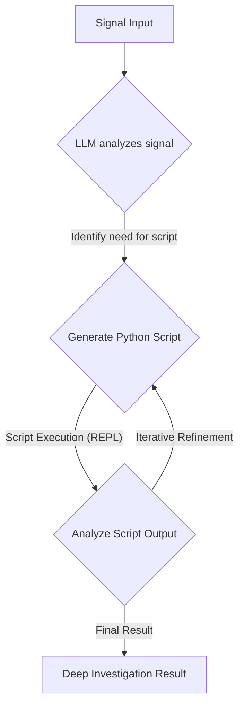

# Catalog Agent Pipeline: Autonomous E-commerce Catalog & Search Management

This project implements a multi-stage autonomous agent pipeline designed to detect, diagnose, fix, evaluate, and release changes for e-commerce catalog and search systems. Leveraging Google's Agent Development Kit (ADK) and `fast-rlm`, it automates complex operational workflows to ensure data quality, search relevance, and efficient release management.

## 🚀 Overview

The Unified Search AI Repair Workflow acts as an intelligent automation layer, responding to "signals" (e.g., detected data inconsistencies, search performance degradation) and orchestrating a series of specialized AI agents via Temporal to resolve them end-to-end, incorporating canary deployments, rollbacks, and a feedback loop.

## 🏗️ Architecture

The system is built upon a modular architecture with a foundational `BaseAgent` and several specialized agents, each responsible for a distinct phase of the operational workflow.

### Core Components:

1.  **`BaseAgent` (`base_agent.py`)**:
    *   **Foundation**: Provides common functionalities for all agents, including LLM model initialization (using `gemini-2.5-flash`), robust tool registration, and the execution mechanism for ADK's `LlmAgent`.
    *   **Context Injection**: Dynamically injects `signal` or `signal_data` into tool calls at runtime, ensuring tools receive necessary contextual information.
    *   **`fast-rlm` Integration**: Integrates `fast-rlm` for advanced "deep investigation" capabilities, allowing agents to generate and execute Python scripts for complex data analysis and remediation.

2.  **Specialized Agents**:
    *   **Phase 1: Root Cause Analysis (RCA)**
        *   **`GoogleRootCauseAgent` (`Catalog/RootCause/google_agent.py`)**: Diagnoses the underlying reasons for catalog or search quality issues. It uses tools like `catalog_coverage`, `schema_validation`, `freshness_check`, `historical_intent`, `search_quality`, `capability_mapping`, and can escalate to `run_deep_rca_investigation` (via `fast-rlm`).
    *   **Phase 2: Fix Proposal & Execution**
        *   **`GoogleFixProposalAgent` (`Catalog/Fix_Proposal/fix_agent.py`)**: Develops and executes remediation plans based on RCA findings. It employs tools such as `llm_inference` (for data generation), `apply_patch`, `vector_refresh`, `trigger_reindex`, `generate_synonyms`, `apply_synonyms`, `generate_semantic_mapping`, `deploy_semantic_rules`, and `run_deep_remediation_script` (via `fast-rlm`).
    *   **Phase 3: Evaluation (Shadow Testing)**
        *   **`EvalAgent` (`Catalog/Eval/eval_agent.py`)**: Evaluates the effectiveness and safety of a deployed fix using metrics and shadow testing. It utilizes `fetch_diffy_report` (to simulate traffic comparison, potentially with mock data) and `evaluate_metrics` (to assess relevance via NDCG).
    *   **Phase 4: Release Management**
        *   **`ReleaseAgent` (`Catalog/Release/release_agent.py`)**: Decides on the deployment action (promote canary, rollback, or no action) based on evaluation. In the Temporal workflow, this decision triggers Kubernetes-simulated canary deployments, promotions, or rollbacks.

3.  **Feedback Agent (`feedback_agent/main.py`)**:
    *   **Functionality**: A FastAPI service that processes the outcome of the entire repair workflow, including verification, metrics comparison, final decision, and audit trails. It provides structured feedback on the effectiveness of the automated pipeline.
    *   **Integration**: Integrated as a Temporal Activity, it receives the final state of the `UnifiedSearchAiRepairWorkflow` to log and analyze the overall process.

4.  **Temporal Workflow Orchestration (`temporal/workflows.py`)**:
    *   **Engine**: Temporal.io acts as the robust orchestration engine, managing the state, retries, and execution of all activities across the pipeline.
    *   **Unified Workflow**: The `UnifiedSearchAiRepairWorkflow` dynamically routes signals (Catalog, Autocomplete, Semantic) to the appropriate RCA and Fix agents, followed by a shared Evaluation, Release, and Feedback process. It supports human-in-the-loop approvals for critical deployment decisions.

## ⚙️ Workflow (Temporal `UnifiedSearchAiRepairWorkflow`)

The entire lifecycle is orchestrated by a Temporal workflow, providing robust state management, retries, and visibility.

```mermaid
graph TD
    A[Initial Signal (signal_data)] --> B{Route to RCA Agent (Catalog, Autocomplete, Semantic)};
    B -- RCA Activity --> C[RCA Output (AgentOutput)];

    C --> D{Route to Fix Proposal Agent};
    D -- Fix Proposal Activity --> E[Fix Report (FixAgentOutput) & Diffy Diff Created];

    E --> F{Evaluation Agent (Shadow Testing)};
    F -- Eval Activity --> G[Evaluation Decision (EvalOutput) & NDCG Score];

    G -- NDCG < Threshold --> H{Human Approval?};
    H -- No / Approved --> I{Release Agent Decision (PROMOTE/ROLLBACK/NO_ACTION)};
    H -- Yes (Paused) --> K[Await Signal];
    K --> I;

    I -- PROMOTE_CANARY --> L[Deploy Canary Activity (simulated kubectl)];
    L --> M[Monitor & Promote Canary Activity (simulated kubectl)];
    M --> N[Final Release Actions];

    I -- ROLLBACK --> O[Rollback Deployment Activity (simulated kubectl)];
    O --> N;

    I -- NO_ACTION --> N[Final Release Actions];

    N --> P{Feedback Agent Activity};
    P --> Q[Feedback Loop Complete];
```

1.  **Signal Ingestion**: The workflow starts with a `signal_data` object describing an issue, routed to the appropriate agent type.
2.  **RCA (Temporal Activity)**: The Root Cause Analysis Agent analyzes the signal, uses its tools to gather evidence, and produces a root cause diagnosis.
3.  **Fix Proposal (Temporal Activity)**: The Fix Proposal Agent receives the RCA output, determines the necessary fixes, executes them (e.g., data enrichment, re-indexing), and initiates a Diffy comparison.
4.  **Evaluation (Temporal Activity)**: The Evaluation Agent assesses the implemented fix, typically by comparing "shadow" (staging) traffic against production using Diffy, and makes a decision to promote or rollback based on metrics like NDCG.
5.  **Human-in-the-Loop**: If evaluation metrics fall below a threshold, the workflow pauses, awaiting human approval via a Temporal Signal.
6.  **Release (Temporal Activity & Kubernetes Simulation)**: The Release Agent decides on the final action. This triggers: 
    *   **Canary Deployment**: A new version is deployed to a small subset of users (simulated via `kubectl` commands).
    *   **Canary Promotion**: If the canary is successful, it's promoted to full production (simulated).
    *   **Rollback**: If issues are detected, the system reverts to the previous stable version (simulated via `kubectl` commands).
7.  **Feedback (Temporal Activity)**: The Feedback Agent receives the final outcome of the entire workflow, providing a structured report on the process, metrics, and decisions for continuous improvement.
8.  **Workflow Completion**: The Temporal workflow marks its completion, returning a summary of the actions taken and feedback results.

## ✨ Detailed Agent Workflows

This section provides a deeper look into the internal logic and tool orchestration of each specialized agent.

### 1. `fast-rlm` Deep Investigation Workflow (within BaseAgent)

`fast-rlm` enables recursive, script-driven analysis for complex issues where standard tools are insufficient.



### 2. `GoogleRootCauseAgent` Workflow

This agent focuses on diagnosing the root cause of catalog and search-related issues.

```mermaid
graph TD
    A[Initial Signal (signal_data)] --> B{LLM receives signal and prompt};
    B -- Reasoning --> C{Selects relevant Tool(s)};
    C -- Tool Input (extracted from signal) --> D[Execute Tool];
    D -- Tool Output --> E{LLM analyzes Tool Output};
    E -- More Info Needed? --> C;
    E -- Root Cause Identified --> F[RCA Output (AgentOutput)];
    E -- Complex Issue? --> G{Escalate to run_deep_rca_investigation};
    G --> H[Deep RCA Result];
    H --> F;
```

### 3. `GoogleFixProposalAgent` Workflow

Responsible for generating and executing remediation plans based on the RCA findings.

```mermaid
graph TD
    A[RCA Output (Fix Signal)] --> B{LLM receives RCA findings};
    B -- Reasoning --> C{Selects relevant Remediation Tool(s)};
    C -- Tool Input --> D[Execute Tool];
    D -- Tool Output --> E{LLM confirms Fix Applied};
    E -- More Fixes Needed? --> C;
    E -- All Fixes Applied --> F[Fix Report (FixAgentOutput)];
```

### 4. `EvalAgent` Workflow

Evaluates the success of a fix, typically using shadow testing and metrics.

```mermaid
graph TD
    A[Fix Proposal Output] --> B{LLM receives Fix Report};
    B -- Reasoning --> C{Execute fetch_diffy_report};
    C -- Diffy Report/Results --> D{Execute evaluate_metrics};
    D -- Metrics Results --> E{LLM analyzes metrics and Diffy};
    E -- Determine decision --> F[Evaluation Decision (EvalOutput)];
```

### 5. `ReleaseAgent` Workflow

Orchestrates the release or rollback of changes based on the evaluation decision.

```mermaid
graph TD
    A[Evaluation Decision (EvalOutput)] --> B{LLM receives decision};
    B -- Decision: PROMOTE_TO_CANARY --> C[Execute initiate_canary_release];
    B -- Decision: ROLLBACK_FIX --> D[Execute execute_rollback];
    C --> E[Release Actions (ReleaseOutput)];
    D --> E;
```

## 🛠️ Setup

To run this end-to-end pipeline, you'll need Docker, Docker Compose, Python 3.9+, and the necessary environment variables.

1.  **Clone the Repository**:
    ```bash
    git clone <your-repo-url>
    cd Team_8_Ops_Automation_Harness-UPDATE_RUNBOOK # Adjust if your clone directory is different
    ```

2.  **Google API Key Configuration**:
    *   Obtain a Google Gemini API Key from the Google AI Studio or Google Cloud Console.
    *   Set it as an environment variable in your shell or a `.env` file in the project root:
        ```bash
        export GOOGLE_API_KEY="YOUR_GEMINI_API_KEY"
        ```
    *   If using `fast-rlm` with OpenRouter, ensure your OpenRouter credits are sufficient or adjust `max_tokens` in `base_agent.py`.

3.  **Install Python Dependencies for Temporal Worker (Optional, for local development/debugging)**:
    *   While the worker will run in Docker, you might want to set up a local virtual environment for development:
    ```bash
    python3 -m venv .venv
    source .venv/bin/activate
    pip install -r requirements.txt
    ```

## ▶️ Running the Unified Search AI Repair Workflow

This project leverages Docker Compose to run all services (Temporal, Diffy, MySQL, Redis, various Agents, Feedback Agent). The main orchestration is handled by Temporal workflows.

1.  **Build and Run Docker Compose Services**:
    Navigate to the project root and execute:
    ```bash
    docker compose build
    docker compose up -d
    ```
    This will start:
    *   `temporal-server` and `temporal-worker`
    *   `diffy-server`, `diffy-mysql`, `diffy-redis`
    *   `autocomplete-agent`, `semantic-agent`, `feedback-agent` (FastAPI service)
    *   (Your `Catalog` agents are integrated as part of the Temporal worker's environment).

2.  **Verify Services (Optional)**:
    You can check the status of your Docker containers:
    ```bash
    docker ps
    ```
    Access the Temporal UI at `http://localhost:8080` (if exposed).
    Access the Diffy UI at `http://localhost:8880`.
    Access the Feedback Agent API at `http://localhost:8000/docs`.

3.  **Trigger a Temporal Workflow**:
    To initiate the `UnifiedSearchAiRepairWorkflow`, you'll use the `temporal/send_signal.py` script. You need to provide a `signal_type` (e.g., `catalog`, `autocomplete`, `semantic`) and optionally a `query`.

    **Example: Triggering a Catalog Repair Workflow**
    ```bash
    python3 temporal/send_signal.py --workflow_id "catalog-repair-$(uuidgen)" --signal_type "catalog" --query "broken product display"
    ```

    The `workflow_id` should be unique for each workflow run. `uuidgen` (on macOS/Linux) can help generate one.

    **Note**: For meaningful RCA and evaluation results, you will need to customize the `signal_data` in `temporal/send_signal.py` to include realistic raw data, logs, or detailed error information that the agents can analyze. The current `signal` is primarily for demonstrating the pipeline flow. You can inspect `temporal/signal_workflow.py` and `temporal/run_unified_workflow.py` for how signals are processed.

4.  **Monitor Workflow Execution**:
    *   Observe the logs of your `temporal-worker` container: `docker logs -f temporal-worker`.
    *   Use the Temporal UI (`http://localhost:8080`) to track workflow progress, activity execution, and outcomes.

5.  **Human-in-the-Loop Approval (if triggered)**:
    If an evaluation results in an NDCG score below the threshold, the workflow will pause. To approve, you'll need to send a signal:
    ```bash
    python3 temporal/signal_workflow.py --workflow_id <YOUR_WORKFLOW_ID> --signal_name approve_deployment
    ```
    Replace `<YOUR_WORKFLOW_ID>` with the actual ID of your running workflow.

---


---
